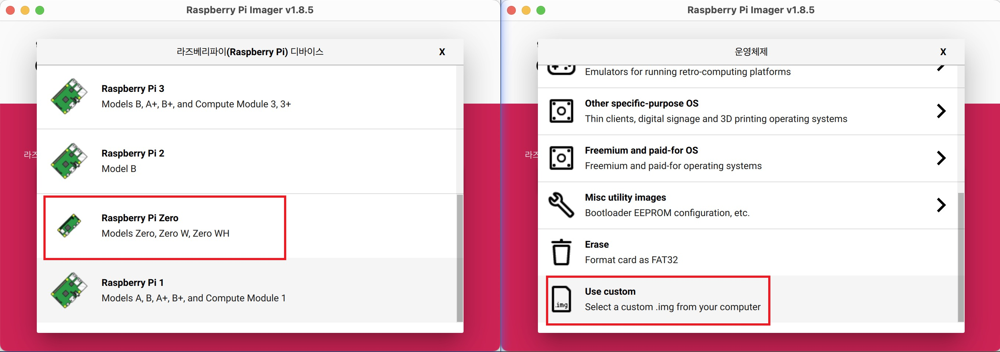
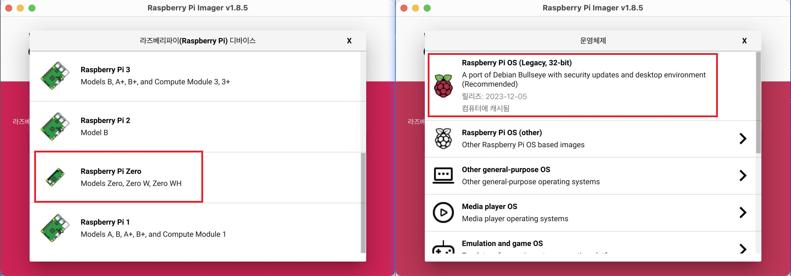

# COBOT_PRO_001

모델: COBOT_PRO_001 -- Raspberry Pi zero로 구동되는 레고 로봇입니다.

버전정보를 참고하세요. [version information](https://github.com/teamgrit-lab/COBOT_PRO_001/blob/main/version.md)

현재 버전은 [v0.0.1.](https://github.com/teamgrit-lab/COBOT_PRO_001/tree/v0.0.1) 입니다.

필요한 `SD카드는 16GB` 이상이어야 합니다. Micro SD카드를 사용하여 컴퓨터에 삽입합니다.

Repository의 Python 파일은 웹소켓을 사용하여 레고 로봇을 원격 제어하기 위한 솔루션을 제공합니다.

`MicroBit Hexfile적용 -> Raspberry Pi Image 설치 -> Image 적용` 순으로 진행하시면 됩니다.

## 목차

1. [Micro:Bit Hex 파일 적용](#microbit-hex-파일-적용)
2. [Raspberry Pi Image 설치](#raspberry-pi-image-설치)
   1. COBOT_PRO_001 이미지를 사용하여 설치하는 방법
   2. 이미지를 만들어 설치하는 방법
3. [COBOT_PRO_001 시작하기](#cobot_pro_001-시작하기)

## Raspberry Pi zero & Micro:Bit

이 프로젝트는 `Raspberry Pi zero` 모델과 BBC의 `Micro:Bit`을 기반으로 합니다.

## 사양

Raspberry Pi zero

- 802.11 b/g/n wireless LAN
- Bluetooth 4.1
- Bluetooth Low Energy (BLE)
- 1GHz, single-core CPU
- 512MB RAM
- Mini HDMI® port and micro USB On-The-Go (OTG) port
- Micro USB power
- HAT-compatible 40-pin header
- Composite video and reset headers
- CSI camera connector

Micro:Bit

- Processor Nordic nRF52833
- Flash memory 512 KB
- RAM 128 KB
- Speed 64 MHz
- Bluetooth Bluetooth 5.1 with Bluetooth Low Energy (BLE)
- Radio communication 2.4 GHz radio (80 channels)
- Buttons Two programmable (A and B) and one system (power/reset)
- On/off switch Press and hold the rear power button
- Touchpad Touch-sensitive logo
- Microphone Onboard Knowles SPU0410LR5H-QB-7 MEMS microphone (with LED indicator)
- Display 5x5 programmable LED matrix (25 LEDs in total)
- Speaker Onboard JIANGSU HUANENG MLT-8530 (up to 80 dB)
- Motion sensor and compass LSM303AGR
- Temperature sensor On-core NRF52
- Edge connector 25 pins

## 추가 정보

Raspberry Pi

자세한 내용이나 기술 지원을 받으려면 [official Raspberry Pi website](https://www.raspberrypi.com/products/raspberry-pi-zero-w/) 를 방문하세요.

Micro:Bit

자세한 내용이나 기술 지원을 받으려면 [official Micro:Bit website](https://tech.microbit.org/hardware/) 를 방문하세요.

# Micro:Bit Hex 파일 적용

1. 현재 `repository`에서 `microbit-\*\*\*.hex` 파일을 다운로드하세요
2. 웹 브라우저로 https://makecode.microbit.org/ 접속하세요.
3. 프로젝트 가져오기 버튼을 클릭하여 다운로드한 `microbit-\*\*\*.hex` 파일을 엽니다.
4. `micro:bit`를 컴퓨터에 연결하는 방법에 대한 지침은 이 링크를 참조하세요.
   - https://makecode.microbit.org/device/usb
5. `micro:bit`가 컴퓨터에 연결되면 다운로드 버튼을 클릭하여 코드를 `micro:bit`에 업로드하세요.

`micro:bit` 준비가 완료되었습니다.

# Raspberry Pi Image 설치

이 문서에서는 공식 Raspberry Pi 웹사이트에서 Raspberry Pi 이미지를 SD 카드에 설치하는 방법에 대한 단계별 지침을 제공합니다. <br/>`2가지 방법`으로 설치를 진행할 수 있습니다.

## 1-1. COBOT_PRO_001 이미지를 사용하여 설치하는 방법

Raspberry Pi 설정이 모두 완료된 이미지 파일입니다.

COBOT_PRO_001 이미지를 다운로드하려면 다음 단계를 따르세요.

1. 웹 브라우저를 열고 다음 URL로 이동하십시오:
   [COBOT_PRO_001 Image Download](https://drive.google.com/file/d/1dSYX8-fjg5oP2c0Ov7hxsfQq17FY7TSt/view?usp=sharing)

2. "다운로드" 버튼을 클릭하세요.

3. 이제 프로젝트에 사용할 COBOT_PRO_001 이미지가 준비되었습니다!

4. [Raspberry Pi Imager](https://www.raspberrypi.com/software/) 프로그램을 다운로드하여 설치합니다 .

5. Raspberry Pi Imager를 실행하고 디바이스(Raspberry Pi Zero), 운영체제(Use custom)를 선택합니다.

6. SD 카드를 선택하고 "쓰기" 버튼을 클릭하여 이미지를 SD 카드에 복사하세요. 만약 OS커스터마이징 사용을 물어보는 경우 '아니요'를 선택하세요.

7. SD 카드를 Raspberry Pi에 삽입하세요.

8. 준비가 완료되었습니다.



## 1-2. 이미지를 만들어 설치하는 방법

### Step 1: Raspberry Pi OS SD카드에 설치

1. [Raspberry Pi Imager](https://www.raspberrypi.com/software/) 프로그램을 다운로드하여 설치합니다 .

2. Raspberry Pi Imager를 실행하고 디바이스(Raspberry Pi Zero), 운영체제(Rasberry Pi OS)를 선택합니다.

3. SD 카드를 선택하고 "쓰기" 버튼을 클릭하여 이미지를 SD 카드에 복사하세요.



### Step 2: Raspberry Pi 부팅

1. Raspberry Pi에 SD카드를 삽입합니다.

2. Raspberry Pi의 전원을 켜고 부팅해 보세요.

3. 초기 설정을 완료합니다. 초기설정시 Wi-Fi 연결을 설정하고, Raspberry Pi OS를 업데이트 및 업그레이드합니다.

이제 Raspberry Pi가 성공적으로 부팅되었습니다

### Step 3: Raspberry Pi 설정

단말기에서 적절한 업데이트 및 업그레이드를 진행해주세요.

```
sudo apt update && sudo apt upgrade -y
```

`raspi-config`를 입력하고 인터페이스 옵션에서 직렬(serial) 및 카메라(Camera) 기능을 활성화하십시오.
serial 기능 활정화에 나오는 Would you like a login shell to be accessible over serial? 를 No로 선택하세요.

```
sudo raspi-config
```

기본 설정이 완료되면 재부팅 후 GStreamer와 웹소켓을 설치합니다.

```
sudo apt-get install -y libx264-dev libjpeg-dev
sudo apt-get install -y libgstreamer1.0-dev
sudo apt-get install -y libgstreamer-plugins-base1.0-dev libgstreamer-plugins-bad1.0-dev gstreamer1.0-plugins-bad-videoparsers gstreamer1.0-plugins-ugly gstreamer1.0-plugins-good gstreamer1.0-tools gstreamer1.0-gl gstreamer1.0-gtk3
```

```
sudo pip3 install websocket_client
sudo pip3 install pyserial
```

마지막으로 `/boot/config.txt` 파일에 uartenable에 대해 작성해야 합니다.

```
sudo nano /boot/config.txt
```

마지막 줄에 다음을 추가하세요.

```
dtoverlay=miniuart-bt
dtoverlay=uart0
dtoverlay=uart1
```

파일 수정 후 재부팅해주세요

이후 파일을 전송을 위해 다음과 같은 `두가지 방법`을 사용할 수 있습니다.

#### - 방법1: Wi-Fi를 통한 파일 전송

`raspi-config`를 입력하고 인터페이스 옵션에서 `ssh` 옵션을 허용해주세요.

```
sudo raspi-config
```

같은 WIFI 네트워크에 연결된 또 다른 컴퓨터에서 이 저장소에 접근하여 파일을 `Raspberry Pi`에 복사하는 방법은 다음과 같습니다.

로컬 컴퓨터에 저장소의 zip 파일을 다운로드하고 압축을 푸세요.

로컬 컴퓨터의 터미널에서 압축을 푼 디렉토리로 이동하세요.

압축을 푼 파일은 다음 명령어를 통해 `Raspberry Pi`로 전송 할 수 있습니다.

```
scp -r /path/to/COBOT_PRO_001 username@ip:/home/username
ex) scp -r /home/user/Downloads/COBOT_PRO_001 pi@192.168.0.101:/home/pi/
```

다운로드 받은 후 `coplay.py` 파일을 실행시키면 로봇이 동작하게 됩니다.

```
sudo python3 coplay.py
```

#### - 방법2: Git을 통한 파일 전송

`Raspberry Pi` 터미널에서 다음 명령어를 통해 저장소를 복제하세요.

업로드한 코드를 복제해서 다운로드 받은 후 `coplay.py` 파일을 실행시키면 로봇이 동작하게 됩니다.

```
git clone https://github.com/teamgrit-lab/COBOT_PRO_001.git
cd COBOT_PRO_001
sudo python3 coplay.py
```

부팅 시 파일이 실행되도록 설정하려면 아래 지침을 따르세요.

```
sudo nano /etc/rc.local
```

`exit 0` 코드 위에 다음의 코드를 추가합니다.

```
sudo python3 /home/{user_name}/COBOT_PRO_001/coplay.py &
exit 0
```

> `&` 기호를 마지막에 작성하는 것을 잊지 마세요 !!

Wi-Fi 연결이 완료된 후 아래 명령으로 재부팅하면 레고 로봇이 작동하기 시작합니다.

```
sudo reboot
```

`Raspberry Pi`가 준비 완료 되었습니다.

# COBOT_PRO_001 시작하기

1. 준비완료된 `Micro:bit`를 삽입합니다.
2. 준비완료된 `Micro SD` 카드를 `Raspberry Pi`에 삽입합니다.
3. Raspberry Pi, micro:bit 확장보드 전원을 켜고 부팅합니다.
4. 디바이스 준비가 완료되었습니다.
