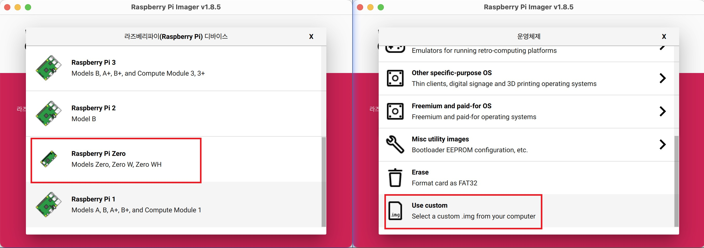

# COBOT_PRO_001

Model: COBOT_PRO_001 -- A LEGO robot powered by a Raspberry Pi zero.

Version information. [version information](https://github.com/teamgrit-lab/COBOT_PRO_001/blob/main/version.md)

The current version is [v0.0.1.](https://github.com/teamgrit-lab/COBOT_PRO_001/tree/v0.0.1).

The required `SD card must be at least 16 GB. Use a micro SD card and insert it into your computer.

The Python files in the repository provide a solution for remote control of LEGO robots using websockets.

To install it, follow these steps: `Apply MicroBit Hexfile -> Install Raspberry Pi Image -> Apply Image`.

Translated with DeepL.com (free version)

## Table of Contents

1. [Applying Micro:Bit Hex Files](#applying-microbit-hex-files)
2. [Install Raspberry Pi Image](#install-raspberry-pi-image)
   1. Using the COBOT_PRO_001 image to install
   2. Using the image to create and install
3. [Getting Started with COBOT_PRO_001](#getting-started-with-cobot_pro_001)

## Raspberry Pi zero & Micro:Bit

This project is based on the `Raspberry Pi zero` model and the BBC's `Micro:Bit`.

## Specification

Raspberry Pi zero

- 802.11 b/g/n wireless LAN
- Bluetooth 4.1
- Bluetooth Low Energy (BLE)
- 1GHz, single-core CPU
- 512MB RAM
- Mini HDMI® port and micro USB On-The-Go (OTG) port
- Micro USB power
- HAT-compatible 40-pin header
- Composite video and reset headers
- CSI camera connector

Micro:Bit

- Processor Nordic nRF52833
- Flash memory 512 KB
- RAM 128 KB
- Speed 64 MHz
- Bluetooth Bluetooth 5.1 with Bluetooth Low Energy (BLE)
- Radio communication 2.4 GHz radio (80 channels)
- Buttons Two programmable (A and B) and one system (power/reset)
- On/off switch Press and hold the rear power button
- Touchpad Touch-sensitive logo
- Microphone Onboard Knowles SPU0410LR5H-QB-7 MEMS microphone (with LED indicator)
- Display 5x5 programmable LED matrix (25 LEDs in total)
- Speaker Onboard JIANGSU HUANENG MLT-8530 (up to 80 dB)
- Motion sensor and compass LSM303AGR
- Temperature sensor On-core NRF52
- Edge connector 25 pins

## Additional information

Raspberry Pi

For more information or technical support, visit the [official Raspberry Pi website](https://www.raspberrypi.com/products/raspberry-pi-zero-w/).

Micro:Bit

For more information or technical support, visit the [official Micro:Bit website](https://tech.microbit.org/hardware/).

# Applying Micro:Bit Hex Files

1. download the file `microbit-\*\*\*.hex` from the current `repository`
2. access https://makecode.microbit.org/ with your web browser
3. click the Import Project button to open the downloaded `microbit-\*\*\*.hex` file.
4. Follow this link for instructions on how to connect `micro:bit` to your computer.
   - https://makecode.microbit.org/device/usb
5. Once the `micro:bit` is connected to your computer, click the Download button to upload the code to the `micro:bit`.

Your `micro:bit` is now ready.

# Install Raspberry Pi Image

This article provides step-by-step instructions on how to install a Raspberry Pi image to an SD card from the official Raspberry Pi website. <br/>You can proceed with the installation in `2 ways`.

## 1-1. Using the COBOT_PRO_001 image to install

This is an image file with the Raspberry Pi fully configured.

To download the COBOT_PRO_001 image, follow these steps

1. open a web browser and navigate to the following URL:
   [COBOT_PRO_001 Image Download](https://drive.google.com/file/d/1dSYX8-fjg5oP2c0Ov7hxsfQq17FY7TSt/view?usp=sharing)

2. Click the "Download" button.

3. You now have the COBOT_PRO_001 image ready to use in your project!

4. Download and install the [Raspberry Pi Imager](https://www.raspberrypi.com/software/) program.

5. run Raspberry Pi Imager and select your device (Raspberry Pi Zero), operating system (Use custom).

6. Select the SD card and click the "Write" button to copy the image to the SD card. If you are asked to use OS customization, choose No.

7. Insert the SD card into your Raspberry Pi.

8. You are ready to go.



## 1-2. Using the image to create and install

### Step 1: Install Raspberry Pi OS on an SD card

1. Download and install the [Raspberry Pi Imager](https://www.raspberrypi.com/software/) program.

2. Run Raspberry Pi Imager and select the device (Raspberry Pi Zero), operating system (Rasberry Pi OS).

3. Select the SD card and click the "Write" button to copy the image to the SD card.


### Step 2: Booting Raspberry Pi

1. insert the SD card into the Raspberry Pi.

2. Power on the Raspberry Pi and let it boot up.

3. Complete the initial setup. Set up a Wi-Fi connection during initial setup, and update and upgrade the Raspberry Pi OS.

Your Raspberry Pi has now booted successfully

### Step 3: Raspberry Pi Configuration

Please perform the appropriate updates and upgrades on your device.

```
sudo apt update && sudo apt upgrade -y
```

Type `raspi-config` and enable the serial and Camera features in the interface options.
Select No for Would you like a login shell to be accessible over serial.

```
sudo raspi-config
```

Once the basic setup is complete, reboot and install GStreamer and Websockets.

```
sudo apt-get install -y libx264-dev libjpeg-dev
sudo apt-get install -y libgstreamer1.0-dev
sudo apt-get install -y libgstreamer-plugins-base1.0-dev libgstreamer-plugins-bad1.0-dev gstreamer1.0-plugins-bad gstreamer1.0-plugins-ugly gstreamer1.0-plugins-good gstreamer1.0-tools gstreamer1.0-gl
```

```
sudo pip3 install websocket_client
sudo pip3 install pyserial
```

Finally, you need to write about uartenable in the `/boot/config.txt` file.

```
sudo nano /boot/config.txt
```

On the last line, add the following

```
dtoverlay=miniuart-bt
dtoverlay=uart0
dtoverlay=uart1
```

Reboot after file modification

Afterward, you can use the following `2 ways` to transfer files

#### - Method 1: Transferring files over Wi-Fi

Please enter `raspi-config` and allow `ssh` option in interface option.

```
sudo raspi-config
```

To access this repository from another computer connected to the same WIFI network and copy the files to your `Raspberry Pi`, follow the steps below.

Download the zip file of the repository on your local computer and unzip it.

In a terminal on your local computer, navigate to the directory you extracted.

Once extracted, the files can be transferred to the `Raspberry Pi` with the following command

```
scp -r /path/to/COBOT_PRO_001-main username@ip:/home/username
ex) scp -r /home/user/Downloads/COBOT_PRO_001-main pi@192.168.0.101:/home/pi/
```

Once downloaded, run the `coplay.py` file to get the robot working.

```
cd COBOT_PRO_001-main
sudo python3 coplay.py
```

#### - Method 2: Transferring files via Git

In the `Raspberry Pi` terminal, clone the repository with the following command.

Once you have cloned and downloaded the uploaded code, run the `coplay.py` file to get the robot working.

```
git clone https://github.com/teamgrit-lab/COBOT_PRO_001.git
cd COBOT_PRO_001
sudo python3 coplay.py
```

To set the file to run on boot, follow the instructions below.

```
sudo nano /etc/rc.local
```

Above the `exit 0` code, add the following code

```
sudo python3 /home/{user_name}/COBOT_PRO_001/coplay.py &
exit 0
```

> Don't forget to write the `&` sign at the end !!!

After the Wi-Fi connection is complete, reboot with the command below and your LEGO robot will start working.

```
sudo reboot
```

Your `Raspberry Pi` is ready to go.

# Getting Started with COBOT_PRO_001

1. Insert the prepared `Micro:bit`.
2. insert the prepared `Micro SD` card into the `Raspberry Pi`.
3. power on and boot the Raspberry Pi, micro:bit expansion board.
4. The device is ready.
